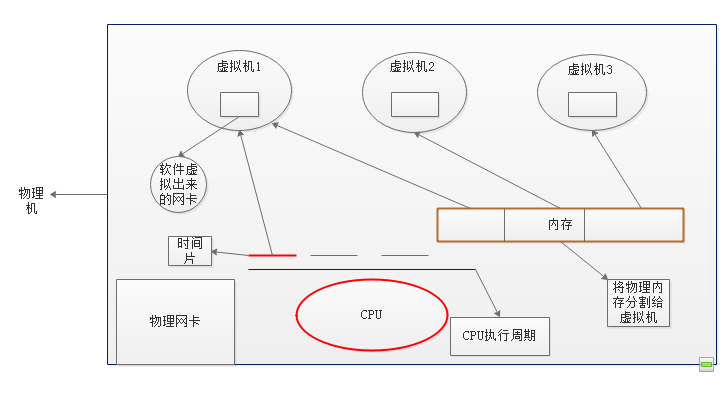
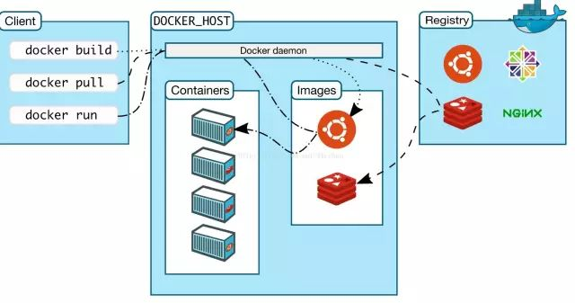

- 虚拟技术
    - 虚拟计算机 
        - KVM 
        - Virtualbox 
        - Vmwares
    - 虚拟操作系统
        - docker 
            - client：`docker`
            - docker_host: container+images
            - registry: images